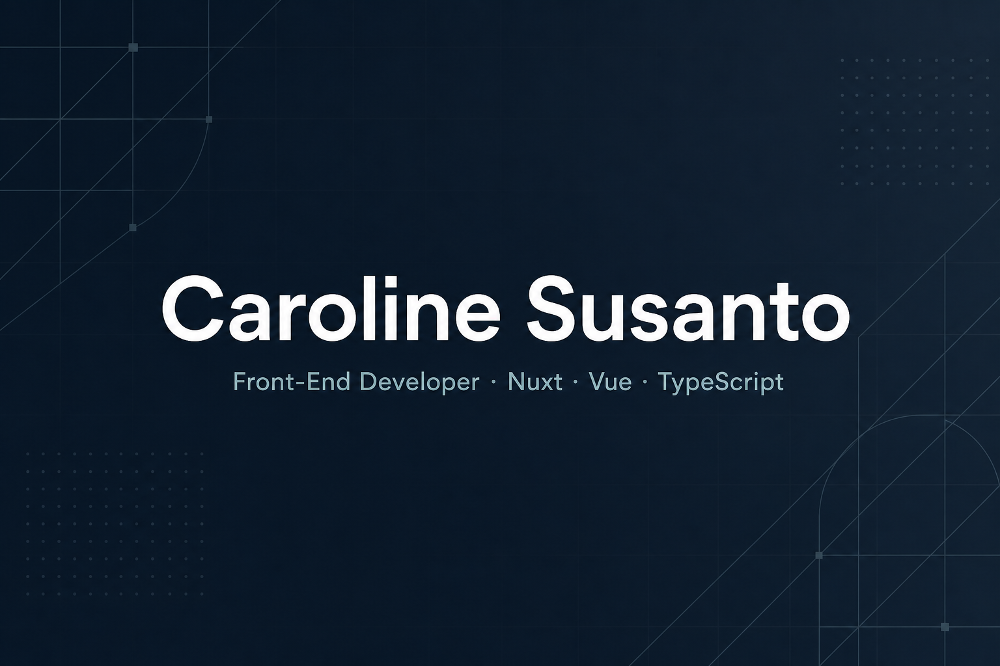

<!-- Profile README for github.com/mirainomire -->

<div align="center">



<br />


<br />


</div>

---

## About Me

I am a Software Engineer specializing in Application Security and AI/Machine Learning Integration. I go beyond just writing functional code. I architect systems with a security-first mindset and leverage AI to automate complex problem-solving.

My expertise lies at the intersection of three core domains:

- **Software Engineering** — Building scalable, production-ready full-stack and backend architectures using Next.js, Vue/Nuxt, Laravel, and Python (Django). I have a proven track record of maintaining high-availability enterprise applications and deploying end-to-end features.
- **Application Security** — Hardening REST APIs against critical vulnerabilities like IDOR, BOLA, and Broken Access Control (BAC). My experience spans from active penetration testing and risk auditing (ISO 27001) to enforcing secure data flow patterns in production environments.
- **AI/ML Integration** — Developing intelligent models and LLM-powered workflows. Recently, I engineered an AI agent that automates API vulnerability detection, achieving an **88.1% accuracy**, **100% precision**, and a **147× speedup** over manual testing. I also architected an AI-driven health monitoring system that was recognized as a **Top 40 Finalist** at the Harvard HSIL Hackathon.

I am a builder who loves combining threat detection, machine learning, and clean code to solve real-world industry challenges. Currently based in Indonesia, I am highly open to international opportunities — whether as distributed remote roles or through global relocation pathways where I can bring my hybrid expertise to a forward-thinking engineering team.

---

### Currently

- 🔭 Working on enterprise web applications
- 🌱 Exploring AI-powered healthcare solutions
- 💼 Front-End Developer
- 🤝 Open to freelance collaboration

---

## Tech Stack

<div align="center">


</div>

<br />

| Frontend | Backend | Security & AI |
| --- | --- | --- |
| Vue · Nuxt · Next.js · TypeScript | Laravel · Django · Python · PHP | OWASP · BAC · IDOR · BOLA |
| JavaScript · Tailwind CSS · PrimeVue | REST API · Oracle · MySQL | AI Agents · LLM workflows |
| Figma · Vercel | Git · OpenAPI | ISO 27001 · Pentesting |

---

### Featured Projects

<div align="center">

<a href="https://github.com/mirainomire/ai_agent_starter">
  
</a>
<a href="https://github.com/mirainomire/gachallenge">
  
</a>

</div>

<br />

🛡️ **[BYEBAC](https://github.com/mirainomire/ai_agent_starter)**  
AI-powered authorization vulnerability testing tool.

🌿 **OneHealth.AI;D**  
Evidence-based zoonosis support for human doctors.

🌐 **[Developer Portfolio](https://porto-topaz-eight.vercel.app/)**  
Personal digital archive built with a modern web stack.

---

### Highlights

- Built enterprise applications using Nuxt 3 and TypeScript
- Developed AI-assisted API security testing
- Experienced in SSO and REST API integration
- Delivered full-stack freelance web projects

---

### Certifications & Achievements

- Hackathon Participant — Harvard HSIL Top 40 Finalist
- Front-End Developer — Nuxt / Vue / TypeScript
- Cybersecurity Researcher — AppSec & BAC detection
- Open-Source Contributor

---

## GitHub Stats

<div align="center">

<!-- Primary: github-readme-stats (may be rate-limited); fallback cards below -->


<br />


</div>

---

## Contribution Snake

<div align="center">


</div>

---

## Contact

<div align="center">

<a href="https://www.linkedin.com/in/caroline-susanto">
  
</a>
&nbsp;
<a href="https://porto-topaz-eight.vercel.app/">
  
</a>
&nbsp;
<a href="mailto:carolinessto@gmail.com">
  
</a>
&nbsp;
<a href="https://github.com/mirainomire">
  
</a>

</div>

---

```text
caroline@github:~$ status
Building meaningful digital experiences...

caroline@github:~$ _
```
